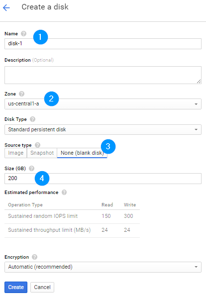

---
Every Compute Engine VM instance is attached to at least one disk as a boot disk and for persistent storage. A persistent disk can be a standard (HDD) or a solid-state (SSD) drive. You can also attach an ephemeral local SSD for high-performance I/O. [Learn more](https://cloud.google.com/compute/docs/disks/?hl=en_US&_ga=1.7348087.47948599.1468921224)

## Setting up Persistent Storage

This example makes use of [persistent disks](https://cloud.google.com/compute/docs/disks/), allowing the application to preserve its state across pod shutdown and start-up.

### Using the Cloud Console
You will need to change sections and go to the [Compute Engine -> Disks](https://console.cloud.google.com/compute/disksAdd) section. I've highlighted the fields that we need to update or double check:

<div style="text-align: center; background: #e1e1e1; padding: 50px;">



<br>
<a  href="https://console.cloud.google.com/compute/disksAdd">https://console.cloud.google.com/compute/disksAdd</a>

</div>

### Using the gcloud shell
```
$ gcloud compute --project "my-test-load-balancing-project" disks create "wordpress-disk-1" --size "200" --zone "us-central1-a" --descripti
on "Persistent disk for WordPress Cluster" --type "pd-standard"

Created [https://www.googleapis.com/compute/v1/projects/my-test-load-balancing-project/zones/us-central1-a/disks/wordpress-disk-1].
NAME              ZONE           SIZE_GB  TYPE         STATUS
wordpress-disk-1  us-central1-a  200      pd-standard  READY
```
